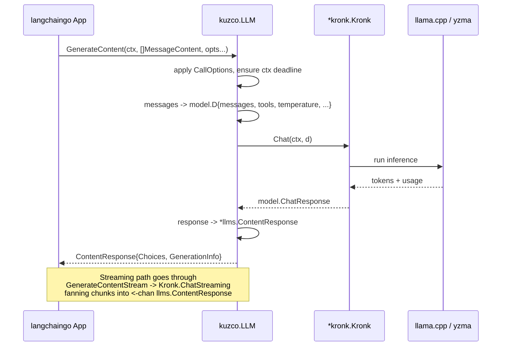

# Kuzco: langchaingo Adapter for ardanlabs/kronk

**PRD ID**: PRD-2026-05-24-2003
**Status**: Draft
**Complexity**: Medium
**Created**: May 24, 2026
**Author**: thetnaingtn

---

## Problem

`github.com/ardanlabs/kronk` is a Go SDK for running local models via llama.cpp (yzma). It exposes its own request/response shapes (`model.D`, `model.ChatResponse`) and OpenAI-style chat semantics, but it does not satisfy the `llms.Model` interface from `github.com/tmc/langchaingo`. As a result, Go developers who want to drive a locally-hosted kronk model from a langchaingo pipeline (chains, agents, memory, prompt templates) have to write their own glue every time.

Kuzco fills that gap: a single, focused adapter package that wraps a `*kronk.Kronk` and exposes a `llms.Model` so kronk-hosted models can be dropped into any langchaingo workflow without modification.

## Solution

Implement a `kuzco.LLM` type in package `kuzco` that holds a `*kronk.Kronk` and implements `llms.Model`:

- `Call(ctx, prompt, opts...) (string, error)` — convenience wrapper that delegates to `GenerateContent`.
- `GenerateContent(ctx, messages, opts...) (*llms.ContentResponse, error)` — translates `[]llms.MessageContent` + `llms.CallOptions` into a kronk `model.D` payload, invokes `Kronk.Chat`, and maps `model.ChatResponse` back into `llms.ContentResponse` (including `Choices[].Content`, `ToolCalls`, `StopReason`, and `GenerationInfo` for token counts).
- Optionally implement `GenerateContentStream` against `Kronk.ChatStreaming` so the `llmtest` streaming capability test runs (kronk requires a context deadline; the adapter must apply one when missing rather than fail the test).
- Optionally implement `Tool` translation: convert `llms.Tool` into the OpenAI-style `tools` array kronk understands.

The package surface is small: `func New(k *kronk.Kronk, opts ...Option) *LLM`, plus the `llms.Model` methods. No other public types unless required to satisfy a capability probe.

Compliance is proven by running `llmtest.TestLLM` from `github.com/tmc/langchaingo/testing/llmtest` against a real `*kronk.Kronk` loaded with a small test model. All Core subtests (`Call`, `GenerateContent`) plus discovered Capabilities (`Streaming`, `ToolCalls`, `Caching`, `TokenCounting`, and `Reasoning` if the loaded model emits it) must pass.

## Summary

_To be completed after implementation._

---

## Scope

### In Scope

- New `kuzco.LLM` type wrapping `*kronk.Kronk` and implementing `llms.Model`.
- Translation of `llms.MessageContent` (including system/human/ai/tool roles and `TextContent`/`ToolCall`/`ToolCallResponse` parts) to kronk's `model.D` chat payload.
- Translation of `llms.CallOptions` (`MaxTokens`, `Temperature`, `TopP`, `StopWords`, `Seed`, `Tools`, `ToolChoice`, `Streaming`/`StreamingFunc`) into the corresponding kronk request keys.
- Mapping `model.ChatResponse` (choices, finish reason, tool calls, usage) back to `llms.ContentResponse`, including `GenerationInfo["PromptTokens"|"CompletionTokens"|"TotalTokens"]`.
- `GenerateContentStream` implementation backed by `Kronk.ChatStreaming` (so the llmtest streaming capability test is exercised, not skipped).
- Automatic context-deadline injection when callers pass a context without one (kronk requires it).
- Full `llmtest.TestLLM` pass against a real, locally loadable model.

### Out of Scope

- Embedding, rerank, tokenize, and acquire APIs (not part of `llms.Model`).
- HTTP handler wrappers (`ChatStreamingHTTP`, `TokenizeHTTP`).
- Multimodal parts (image/audio) — text only in v1, with a TODO if a kronk vision model is loaded.
- Configuration of the underlying `*kronk.Kronk` (loading the model, GGUF acquisition); callers construct and pass it in.
- A CLI or examples binary.

### Target Users

| Role                          | Impact                                                                                         |
| ----------------------------- | ---------------------------------------------------------------------------------------------- |
| Go application developer      | Can drop a kronk-hosted local model into any langchaingo chain or agent without writing glue.  |
| Library/framework integrator  | Gets a reference implementation of `llms.Model` they can compose with langchaingo abstractions.|
| Local-inference experimenter  | Uses langchaingo prompt templates and tools against on-device models with no cloud dependency. |

---

## Technical Design

### Architecture



### Database Changes

| Table | Change | Reason       |
| ----- | ------ | ------------ |
| —     | None   | No persistence; pure adapter library. |

### Backend

| Component        | Changes                                                                                                          |
| ---------------- | ---------------------------------------------------------------------------------------------------------------- |
| `kuzco.LLM`      | New struct holding `*kronk.Kronk` + optional defaults (default timeout, default max tokens).                     |
| `New` / `Option` | Constructor `New(k *kronk.Kronk, opts ...Option) *LLM`; options for default timeout, default model name override.|
| Message mapping  | `messagesToKronk([]llms.MessageContent) []map[string]any` covering text, tool call, and tool response parts.     |
| Options mapping  | `applyCallOptions(d model.D, opts llms.CallOptions)` for temperature/top_p/max_tokens/stop/seed/tools/tool_choice. |
| Response mapping | `chatResponseToContent(model.ChatResponse) *llms.ContentResponse` including `ToolCalls`, `StopReason`, usage info.|
| Streaming        | `GenerateContentStream` adapting `<-chan model.ChatResponse` to `<-chan llms.ContentResponse`; invoke `StreamingFunc` per chunk.|
| Context deadline | Helper that wraps ctx in `context.WithTimeout(defaultTimeout)` when no deadline is present.                      |

### Frontend

| Component | Changes |
| --------- | ------- |
| —         | N/A — library package, no UI. |

---

## Implementation

### Phase 1: Data / Type Mapping

- [ ] Add `kronk` v1.26.1 dependency to `go.mod` and run `go mod tidy`.
- [ ] Define `kuzco.LLM` struct and `Option` / `New` constructor in `kuzco.go`.
- [ ] Implement `messagesToKronk` covering `ChatMessageTypeSystem|Human|AI|Tool|Generic` and `TextContent` / `ToolCall` / `ToolCallResponse` parts (return error on unsupported part such as image/binary).
- [ ] Implement `toolsToKronk` for `[]llms.Tool` → kronk `tools` array (OpenAI function-tool shape).
- [ ] Implement `applyCallOptions` mapping `llms.CallOptions` to kronk `model.D` keys (`temperature`, `top_p`, `max_tokens`, `stop`, `seed`, `tools`, `tool_choice`, `stream`).
- [ ] Implement `chatResponseToContent` mapping choices, content, tool calls, finish reason, and usage → `GenerationInfo`.

### Phase 2: Adapter Surface

- [ ] Implement `GenerateContent(ctx, messages, opts...)`: build options via `llms.CallOptions`, ensure context deadline, call `kronk.Chat`, map response.
- [ ] Implement `Call(ctx, prompt, opts...)` via `llms.GenerateFromSinglePrompt`-style delegation to `GenerateContent`.
- [ ] Implement `GenerateContentStream(ctx, messages, opts...)`: call `kronk.ChatStreaming`, translate per-chunk responses into `llms.ContentResponse`, and invoke `opts.StreamingFunc` if set; close the output channel when the kronk channel closes.
- [ ] Add compile-time assertion `var _ llms.Model = (*LLM)(nil)`.
- [ ] Add doc.go with a usage example showing `kronk.New(...)` → `kuzco.New(k)` → langchaingo chain.

### Phase 3: Test Suite & Verification

- [ ] Replace the placeholder `TestMe` in `kuzco.go` with a proper `kuzco_test.go` that:
  - boots a `*kronk.Kronk` against a tiny local GGUF model (env-gated via `KUZCO_TEST_MODEL_PATH`; test is `t.Skip`'d when unset, so CI without GPU still passes compile).
  - constructs `kuzco.New(k)` and calls `llmtest.TestLLM(t, llm)`.
- [ ] Add focused unit tests (no model required) for `messagesToKronk`, `toolsToKronk`, `applyCallOptions`, and `chatResponseToContent` using table-driven cases.
- [ ] Verify all `llmtest` Core subtests pass (`Call`, `GenerateContent`) and that the `Streaming` and `TokenCounting` capability subtests run and pass.
- [ ] Run `go vet ./...` and `go test ./...` clean.

---

## Security

| Concern          | Mitigation                                                                                                  |
| ---------------- | ----------------------------------------------------------------------------------------------------------- |
| Authorization    | N/A — library runs in-process; auth is the embedding application's responsibility.                          |
| Input validation | Reject `MessageContent` parts the adapter cannot represent (e.g. binary/image) with a typed error instead of silently dropping content. |
| Data exposure    | Do not log prompt or response bodies from the adapter; let callers attach their own logging via langchaingo callbacks. |
| Resource limits  | Always enforce a context deadline before calling kronk (kronk hard-requires one); document the default and let callers override. |

---

## Testing

**Automated:**

```bash
go vet ./...
go test ./... -run TestLLM -v
# Full compliance test against a real model (requires a local GGUF):
KUZCO_TEST_MODEL_PATH=/path/to/model.gguf go test ./... -run TestLLM -v
```

**Manual Verification:**

1. Load a small instruction-tuned GGUF via `kronk.New(model.WithModelPath(...))`.
2. Wrap it: `llm := kuzco.New(k)`.
3. Run `llms.GenerateFromSinglePrompt(ctx, llm, "Say OK")` and confirm a non-empty response.
4. Build a minimal langchaingo `chains.NewLLMChain(llm, prompt)` and invoke it; confirm the chain produces output.
5. Call `llm.GenerateContent(ctx, msgs, llms.WithStreamingFunc(printChunk))` and confirm `printChunk` is invoked multiple times before completion.
6. Pass an `llms.Tool` definition and confirm `resp.Choices[0].ToolCalls` is populated for a tool-capable model.

---

## Risks

| Risk                                                                                  | Likelihood | Mitigation                                                                                          |
| ------------------------------------------------------------------------------------- | ---------- | --------------------------------------------------------------------------------------------------- |
| kronk's `model.D` schema drifts between versions, breaking the request mapping.       | Med        | Pin to kronk v1.26.1 in `go.mod`; cover request shape with unit tests; revisit on each kronk bump.  |
| `llmtest` probes capabilities by sending one-token requests — kronk requires deadline.| High       | Centralised `ensureDeadline(ctx)` helper that defaults to e.g. 60s when missing.                    |
| Tool-call semantics differ between kronk's OpenAI-shape and langchaingo's `ToolCall`. | Med        | Explicit translation layer with table-driven tests covering both directions (request and response). |
| Streaming chunk shape from kronk may not be incremental deltas (could be cumulative). | Med        | Inspect `model.ChatResponse.Delta` vs `Message` in chat.go; emit `Delta` content when present, full content otherwise; document behaviour. |
| Real-model test requires GPU/large download — flaky in CI.                            | High       | Gate the integration test behind `KUZCO_TEST_MODEL_PATH`; keep unit tests model-free.               |

---

## Definition of Done

- [ ] `kuzco.LLM` implements `llms.Model` (compile-time assertion present).
- [ ] `llmtest.TestLLM` passes end-to-end against a real local model.
- [ ] Unit tests for mapping helpers pass without a model.
- [ ] `go vet ./...` and `go test ./...` clean.
- [ ] `doc.go` includes a copy-pasteable usage example.
- [ ] PR approved and merged to `main`.

---

## Files Changed

| Category | Files                       | Description                                                                       |
| -------- | --------------------------- | --------------------------------------------------------------------------------- |
| Library  | `kuzco.go`                  | Replace placeholder; define `LLM`, `Option`, `New`, and `llms.Model` methods.     |
| Library  | `messages.go`               | `messagesToKronk`, `toolsToKronk`, `applyCallOptions`, `chatResponseToContent`.   |
| Library  | `stream.go`                 | `GenerateContentStream` implementation.                                           |
| Library  | `doc.go`                    | Package-level doc + runnable example.                                             |
| Tests    | `kuzco_test.go`             | `llmtest.TestLLM` integration (env-gated) + unit tests for mappers.               |
| Deps     | `go.mod`, `go.sum`          | Add `github.com/ardanlabs/kronk v1.26.1`.                                         |

---

## Related

- **Issues**: _none yet_
- **PRs**: _none yet_
- **Docs**:
  - langchaingo `llms.Model`: https://pkg.go.dev/github.com/tmc/langchaingo/llms#Model
  - langchaingo `llmtest`: https://pkg.go.dev/github.com/tmc/langchaingo/testing/llmtest
  - kronk SDK: https://pkg.go.dev/github.com/ardanlabs/kronk/sdk/kronk

---

_Last updated: May 24, 2026_
