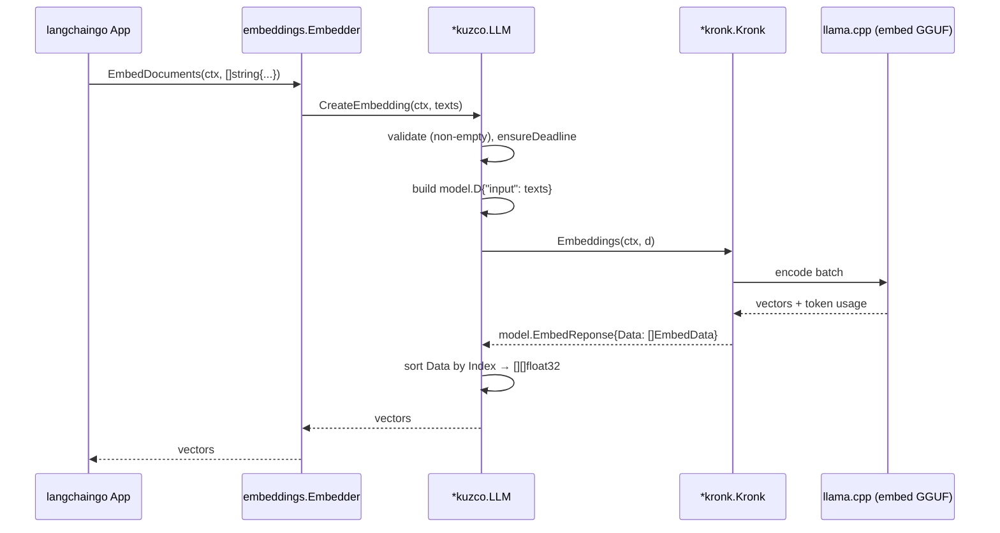

# Kuzco: langchaingo `embeddings.EmbedderClient` Adapter

**PRD ID**: PRD-2026-05-26-1121
**Status**: Draft
**Complexity**: Low
**Created**: May 26, 2026
**Author**: thetnaingtn

---

## Problem

`kuzco.LLM` already satisfies `github.com/tmc/langchaingo/llms.Model` (chat, streaming, tool calls) so kronk-hosted chat models drop cleanly into langchaingo chains and agents. The companion interface for vector workflows — `github.com/tmc/langchaingo/embeddings.EmbedderClient` — is **not** implemented, so callers cannot pass a `*kuzco.LLM` to `embeddings.NewEmbedder(...)` to build a langchaingo `Embedder` for vector stores or retrievers.

Kronk has a first-class embedding API (`Kronk.Embeddings(ctx, model.D{"input": ...}) (model.EmbedReponse, error)`), so the gap is purely a thin translation layer. Without it, any user wanting to use a kronk-hosted embedding GGUF (e.g. BGE, nomic-embed) inside a langchaingo pipeline has to write the same glue every time, defeating the purpose of having a single adapter package.

## Solution

Add **one** method to the existing `*kuzco.LLM`:

```go
func (l *LLM) CreateEmbedding(ctx context.Context, texts []string) ([][]float32, error)
```

Implementation outline:
- Reject empty `texts` with a typed `kuzco`-prefixed error.
- Apply the existing `ensureDeadline(ctx)` helper (kronk hard-requires a context deadline).
- Build `model.D{"input": texts}` and invoke `l.k.Embeddings(ctx, d)`.
- Map `resp.Data` → `[][]float32` ordered by `EmbedData.Index` (kronk documents but does not strictly guarantee insertion order; sorting makes the contract explicit and survives any future concurrency change).
- Wrap kronk errors as `fmt.Errorf("kuzco: embeddings: %w", err)`.

Add a compile-time assertion next to the existing `llms.Model` assertion:

```go
var _ embeddings.EmbedderClient = (*LLM)(nil)
```

Callers then write:

```go
llm := kuzco.New(k) // k is a *kronk.Kronk loaded with an embed-capable GGUF
embedder, err := embeddings.NewEmbedder(llm)
vec, err := embedder.EmbedQuery(ctx, "hello")
```

## Summary

_Filled in after implementation is complete._

---

## Scope

### In Scope

- New method `(*LLM).CreateEmbedding(ctx, []string) ([][]float32, error)` in a new `embeddings.go` file.
- Empty-input validation with a typed error.
- Deterministic ordering of returned vectors by `EmbedData.Index`.
- Reuse of the existing `ensureDeadline` helper.
- Compile-time assertion `var _ embeddings.EmbedderClient = (*LLM)(nil)`.
- Model-free unit tests for the response-to-vectors mapper and the empty-input error.
- Integration test gated behind a `//go:build integration` build tag plus a new `EMBED_MODEL_URL` env var (independent of the existing `MODEL_URL` chat test), exercising `embeddings.NewEmbedder(kuzco.New(k))` end-to-end.
- Migrate the existing `kuzco_test.go` chat integration test to the same `//go:build integration` build tag so both integration tests opt in through a single mechanism; keep the env-var gating (`MODEL_URL`, `EMBED_MODEL_URL`) inside the tagged build so individual tests still skip cleanly.
- Doc example in `doc.go` showing the embedder usage.

### Out of Scope

- Embedding options (`dimensions` / `truncate` / `truncate_direction`) — see **Future Work**.
- Kronk's rerank API.
- Multimodal embeddings (image/audio).
- Configuring the embedding model itself; callers construct `*kronk.Kronk` with an embed-capable GGUF.
- Batching strategy beyond what kronk's `Embeddings` already does internally.

### Target Users

| Role                          | Impact                                                                                              |
| ----------------------------- | --------------------------------------------------------------------------------------------------- |
| Go application developer      | Can drop a kronk-hosted embedding model into any langchaingo vector store / retriever pipeline.     |
| RAG pipeline integrator       | Uses one `*kuzco.LLM` for both chat (`llms.Model`) and embeddings (`embeddings.EmbedderClient`).    |
| Local-inference experimenter  | Generates embeddings against on-device GGUFs without cloud calls and without writing glue code.     |

---

## Technical Design

### Architecture



### Database Changes

| Table | Change | Reason                                |
| ----- | ------ | ------------------------------------- |
| —     | None   | No persistence; pure adapter library. |

### Backend

| Component        | Changes                                                                                                  |
| ---------------- | -------------------------------------------------------------------------------------------------------- |
| `kuzco.LLM`      | Add `CreateEmbedding` method; no struct field changes; reuses `ensureDeadline`.                          |
| `embeddings.go`  | New file holding `CreateEmbedding` plus an internal `embedResponseToVectors(model.EmbedReponse) [][]float32` helper that sorts by `EmbedData.Index`. |
| `kuzco.go`       | Add second compile-time assertion: `var _ embeddings.EmbedderClient = (*LLM)(nil)`.                      |
| `doc.go`         | Add `ExampleNew_embedder` showing `embeddings.NewEmbedder(kuzco.New(k))` and `EmbedQuery`.               |

### Frontend

| Component | Changes                       |
| --------- | ----------------------------- |
| —         | N/A — library package, no UI. |

---

## Implementation

### Phase 1: Data / Type Mapping

- [ ] Define `var ErrEmptyInput = errors.New("kuzco: embeddings: texts must not be empty")` (or equivalent unexported sentinel if preferred).
- [ ] Implement internal `embedResponseToVectors(resp model.EmbedReponse) [][]float32`: copy `resp.Data` slice, sort by `EmbedData.Index`, build `[][]float32`.
- [ ] Add table-driven unit tests in `embeddings_test.go` covering: empty input → typed error; in-order response preserved; out-of-order `Index` reordered; per-row dimensionality preserved.

### Phase 2: Adapter Surface

- [ ] Create `embeddings.go` with `func (l *LLM) CreateEmbedding(ctx context.Context, texts []string) ([][]float32, error)`.
- [ ] Inside: empty-input check, `l.ensureDeadline(ctx)`, build `model.D{"input": texts}`, call `l.k.Embeddings(ctx, d)`, wrap error as `fmt.Errorf("kuzco: embeddings: %w", err)`, return mapper result.
- [ ] In `kuzco.go`, add `var _ embeddings.EmbedderClient = (*LLM)(nil)` next to the existing `llms.Model` assertion.
- [ ] In `doc.go`, add a runnable `ExampleNew_embedder` showing `kronk.New` → `kuzco.New` → `embeddings.NewEmbedder(llm)` → `EmbedQuery`.

### Phase 3: Test Suite & Verification

- [ ] Add `embeddings_integration_test.go` (or extend `kuzco_test.go`) gated on `EMBED_MODEL_URL`: use kronk's `libs.New()` + `models.New()` to download an embed-capable GGUF, construct `kronk.New(...)`, wrap with `kuzco.New`, pass to `embeddings.NewEmbedder`, assert `EmbedDocuments([]string{"hello", "world"})` returns two vectors of equal length and `EmbedQuery("hi")` returns one vector of the same length. Skip cleanly when env var is unset.
- [ ] Run `go vet ./...` and `go test ./...` clean.
- [ ] Sanity check against a chat-only GGUF: confirm the kronk "model doesn't support embedding" error surfaces unchanged (wrapped with the `kuzco:` prefix).

---

## Security

| Concern          | Mitigation                                                                                            |
| ---------------- | ----------------------------------------------------------------------------------------------------- |
| Authorization    | N/A — library runs in-process; auth is the embedding application's responsibility.                    |
| Input validation | Reject empty `texts` slice with a typed error before calling kronk.                                   |
| Data exposure    | Do not log input texts or embedding vectors; let callers attach langchaingo callbacks if they need observability. |
| Resource limits  | Reuse `ensureDeadline` so every kronk embedding call has a context deadline (kronk hard-requires it). |

---

## Testing

**Automated:**

```bash
# Units only — default build, no integration tests compiled in:
go vet ./...
go test ./... -v

# Integration tests (chat + embeddings) compiled in via build tag.
# Each test still skips if its own env var is unset.
MODEL_URL=https://.../qwen2.5-...-Q8_0.gguf \
EMBED_MODEL_URL=https://.../bge-small-en-v1.5-q8_0.gguf \
  go test -tags=integration ./... -v
```

**Manual Verification:**

1. Acquire an embed-capable GGUF (e.g. BGE small, nomic-embed-text) and a matching llama.cpp library bundle via kronk's `libs` package.
2. `k, _ := kronk.New(model.WithModelPath(...))`; confirm `modelInfo.IsEmbedModel` is true (otherwise kronk will reject).
3. `llm := kuzco.New(k)`.
4. `embedder, _ := embeddings.NewEmbedder(llm)`.
5. Call `embedder.EmbedDocuments(ctx, []string{"hello", "world"})` and confirm two non-empty vectors of equal length.
6. Call `embedder.EmbedQuery(ctx, "hi")` and confirm a single vector of the same length.
7. Plug the embedder into a langchaingo vector store (e.g. `chroma` or `pgvector`) and confirm an `AddDocuments` round-trip works end-to-end.

---

## Risks

| Risk                                                                                       | Likelihood | Mitigation                                                                                                  |
| ------------------------------------------------------------------------------------------ | ---------- | ----------------------------------------------------------------------------------------------------------- |
| Caller loads a chat-only GGUF → kronk returns "model doesn't support embedding".           | Med        | Surface kronk's error verbatim (wrapped with `kuzco: embeddings:` prefix). Document the model-mode requirement in the doc example. |
| `EmbedData.Index` not strictly insertion-ordered after future kronk concurrency changes.   | Low        | Explicit sort by `Index` in the mapper + a dedicated reordering unit test.                                  |
| Long batches exceed the default 60s deadline.                                              | Low        | `ensureDeadline` only injects a deadline when none is set; callers passing large batches can use `WithDefaultTimeout` or pass a ctx with their own deadline. |
| Real-model integration test is flaky in CI (GPU/network).                                  | High       | Gate behind `EMBED_MODEL_URL`; unit tests are model-free and always run.                                    |
| Future need for `dimensions` / `truncate` / `truncate_direction` options.                  | Med        | Documented as **Future Work**; kronk already supports the keys, so the follow-up change is mechanical.      |

---

## Definition of Done

- [ ] `(*LLM).CreateEmbedding` implemented and compiled.
- [ ] `var _ embeddings.EmbedderClient = (*LLM)(nil)` compiles in `kuzco.go`.
- [ ] Model-free unit tests for the mapper and empty-input error pass.
- [ ] `EMBED_MODEL_URL`-gated integration test passes against a real embed GGUF.
- [ ] `go vet ./...` and `go test ./...` clean.
- [ ] `doc.go` example demonstrates `embeddings.NewEmbedder(kuzco.New(k))`.
- [ ] PR approved and merged.

---

## Files Changed

| Category | Files                                          | Description                                                                  |
| -------- | ---------------------------------------------- | ---------------------------------------------------------------------------- |
| Library  | `embeddings.go` (new)                          | `CreateEmbedding` method + `embedResponseToVectors` helper.                  |
| Library  | `kuzco.go`                                     | Add `var _ embeddings.EmbedderClient = (*LLM)(nil)` next to the `llms.Model` assertion. |
| Library  | `doc.go`                                       | Add `ExampleNew_embedder` showing kronk → kuzco → langchaingo embedder.      |
| Tests    | `embeddings_test.go` (new)                     | Unit tests for the mapper and empty-input error (no model required).         |
| Tests    | `embeddings_integration_test.go` (new)         | `//go:build integration` + `EMBED_MODEL_URL`-gated end-to-end test using `embeddings.NewEmbedder`. |
| Tests    | `kuzco_test.go`                                | Add `//go:build integration` tag to the chat integration test; move the non-integration `TestCompile` into a new untagged file so default `go test ./...` still compiles. |
| Tests    | `kuzco_compile_test.go` (new, untagged)        | Hosts the `TestCompile` no-op so the default build still asserts package compiles + interface assertions hold. |

---

## Future Work

Recorded here because the user explicitly chose **minimal scope** for v1 and wants this decision visible for a follow-up.

- **Embedding options.** Kronk already supports `dimensions` (Matryoshka), `truncate`, and `truncate_direction` in `model.D` (`sdk/kronk/model/embed.go:54-63`). A follow-up PRD should introduce a `kuzco.EmbedOption` pattern (`WithDimensions(int)`, `WithTruncate(bool)`, `WithTruncateDirection(string)`) and a variadic on `CreateEmbedding`, mirroring the existing `Option` pattern on `New`. The langchaingo `EmbedderClient` interface itself does not accept options, so these would be configured at construction time (similar to `WithDefaultTimeout`).
- **Rerank.** Kronk exposes rerank; langchaingo does not yet have a standard rerank interface, so we'd ship a kuzco-native API rather than wait.
- **Batching policy.** Today kronk handles batching internally. If callers complain about latency on very large `texts` slices, expose a `WithEmbedBatchSize` option or rely on langchaingo's `BatchedEmbed` helper at the call site.

---

## Related

- **Issues**: _none yet_
- **PRs**: _none yet_
- **Prior PRD**: `docs/PRDs/done/2026-05-24-2003-kuzco-langchaingo-adapter.md` (the `llms.Model` adapter this builds on)
- **Docs**:
  - langchaingo `embeddings.EmbedderClient`: https://pkg.go.dev/github.com/tmc/langchaingo/embeddings#EmbedderClient
  - langchaingo `embeddings.NewEmbedder`: https://pkg.go.dev/github.com/tmc/langchaingo/embeddings#NewEmbedder
  - kronk SDK `Embeddings`: https://pkg.go.dev/github.com/ardanlabs/kronk/sdk/kronk#Kronk.Embeddings

---

_Last updated: May 26, 2026_
