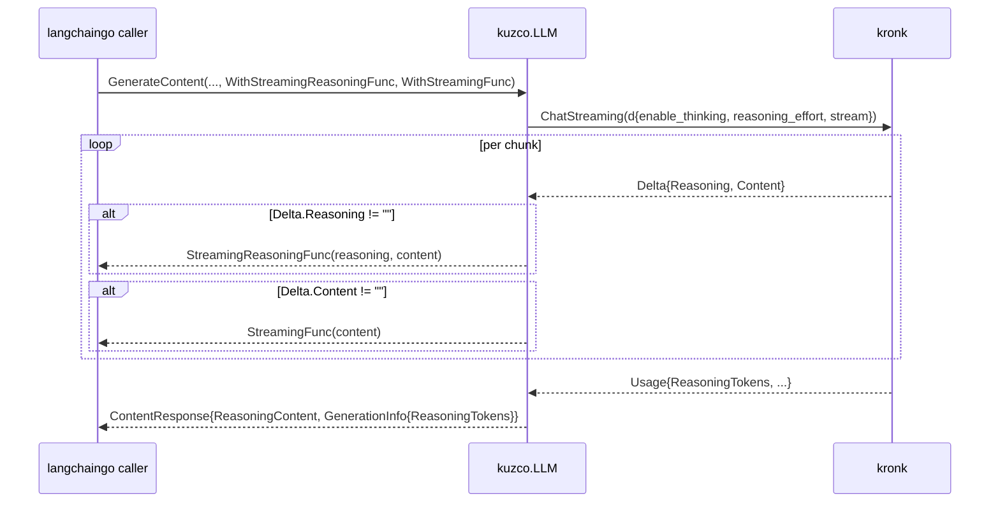

# Reasoning Capability & Streaming Passthrough

**PRD ID**: PRD-2026-06-28-1303
**Status**: Draft
**Complexity**: Low
**Created**: June 28, 2026
**Author**: thetnaingtn

---

## Problem

kuzco wraps kronk to satisfy langchaingo's `llms.Model`. kronk runs reasoning ("thinking") on by
default and emits it on a dedicated channel — request controls (`enable_thinking`,
`reasoning_effort`), a `reasoning_content` response field, separate streaming reasoning deltas, and a
`Usage.ReasoningTokens` counter. The request mapping (`applyThinking`) and the non-streaming response
mapping (`cc.ReasoningContent = msg.Reasoning`) are already in place, so reasoning content already
flows for batch calls.

Three pieces of the bridge are still missing, and each one silently degrades a real caller. First,
kuzco does not satisfy langchaingo's `llms.ReasoningModel` interface, so callers using
`SupportsReasoning()` / `SupportsReasoningModel()` to feature-detect see kuzco as a non-reasoning
model. Second, kronk's per-token reasoning deltas are accumulated but never forwarded to langchaingo's
`StreamingReasoningFunc`, so streaming callers get no live reasoning — it only appears in the final
response. Third, `Usage.ReasoningTokens` is dropped on the floor, so token accounting and
`llms.ExtractThinkingTokens` under-report. These gaps pass every non-streaming test and fail only for
reasoning-aware and streaming callers, which is exactly why they are worth closing deliberately.

## Solution

Finish the reasoning wiring symmetrically, following kronk's model rather than inventing capability
heuristics:

1. **Capability flag** — implement `llms.ReasoningModel` with `SupportsReasoning() bool` returning
   `true`, and add the compile-time interface assertion. kronk exposes no per-model reasoning flag
   (no `IsReasoningModel` analogous to `IsEmbedModel`); reasoning is a per-request behavior that is
   on by default, so a constant `true` is the honest answer for kuzco.
2. **Streaming reasoning passthrough** — in both streaming entry points (`GenerateContent`'s
   accumulation loop and `GenerateContentStream`'s emit loop), forward kronk's `Delta.Reasoning` to
   `co.StreamingReasoningFunc(ctx, reasoningChunk, contentChunk)`, leaving the existing content-only
   `StreamingFunc` path untouched.
3. **Usage passthrough** — surface `Usage.ReasoningTokens` as `GenerationInfo["ReasoningTokens"]`,
   matching the existing zero-skip pattern and the key langchaingo's `ExtractThinkingTokens` reads.

TDD per project convention: tests are written first and must fail before each change.

## Summary

_To be completed after implementation: kuzco satisfies `llms.ReasoningModel`, streams reasoning
deltas symmetrically across both streaming paths, and reports reasoning token usage._

---

## Scope

### In Scope

- Implement `llms.ReasoningModel.SupportsReasoning()` returning `true` + compile-time assertion.
- Forward reasoning deltas to `StreamingReasoningFunc` in `GenerateContent` and
  `GenerateContentStream`.
- Surface `Usage.ReasoningTokens` in `GenerationInfo`.
- Unit tests (TDD) for all three; integration check via the LLM suite's Reasoning subtest.
- README note documenting reasoning support (new interface + streaming reasoning).

### Out of Scope

- Per-model reasoning detection / heuristics (kronk exposes no flag; kuzco deliberately returns
  `true`).
- Changes to `applyThinking` request mapping (already correct).
- `InterleaveThinking` / explicit thinking-token-budget beta features (no kronk equivalent surfaced).
- Any embeddings changes.

### Target Users

| Role | Impact |
| --- | --- |
| langchaingo app developers using kuzco | Can feature-detect reasoning via `SupportsReasoning()` and receive live streamed reasoning deltas. |
| Operators / cost tracking | Reasoning token usage becomes visible in `GenerationInfo`. |

---

## Technical Design

### Architecture



### Database Changes

| Table | Change | Reason |
| --- | --- | --- |
| n/a | none | Library adapter; no persistence. |

### Backend (Go package — flat root)

| Component | Changes |
| --- | --- |
| `kuzco.go` | Add `_ llms.ReasoningModel = (*LLM)(nil)` assertion; add `SupportsReasoning() bool`; forward `Delta.Reasoning` to `StreamingReasoningFunc` in the `GenerateContent` accumulation loop. |
| `stream.go` | Add `chunkReasoning` helper; forward reasoning deltas to `StreamingReasoningFunc` in `GenerateContentStream`. |
| `messages.go` | In `chatResponseToContent`, add `GenerationInfo["ReasoningTokens"]` (zero-skipped). |

### Frontend

| Component | Changes |
| --- | --- |
| n/a | No frontend. |

---

## Implementation

### Phase 1: Capability flag (#1)

- [ ] Add unit test asserting `*kuzco.LLM` satisfies `llms.ReasoningModel` and `SupportsReasoning()` returns `true`.
- [ ] Add `_ llms.ReasoningModel = (*LLM)(nil)` to the assertion block in `kuzco.go`.
- [ ] Implement `func (l *LLM) SupportsReasoning() bool { return true }` with a doc comment explaining kronk's thinking-on-by-default model and absence of a per-model flag.

### Phase 2: Usage passthrough (#3)

- [ ] Add/extend a `chatResponseToContent` test asserting `GenerationInfo["ReasoningTokens"]` is set when `Usage.ReasoningTokens > 0` and absent when zero (optionally cross-check `llms.ExtractThinkingTokens`).
- [ ] Add `gi["ReasoningTokens"] = u.ReasoningTokens` (guarded by `!= 0`) in `chatResponseToContent`.

### Phase 3: Streaming reasoning passthrough (#2)

- [ ] Add streaming unit tests (both `GenerateContent` and `GenerateContentStream`) feeding fake reasoning deltas and asserting `StreamingReasoningFunc` receives them in order; assert content `StreamingFunc` is unaffected.
- [ ] Forward reasoning deltas to `StreamingReasoningFunc` in `GenerateContent` accumulation loop (cancel + wrap error on failure, mirroring existing `StreamingFunc`).
- [ ] Add `chunkReasoning` helper and forward reasoning deltas in `GenerateContentStream`.
- [ ] Update `README.md` with a reasoning-support note (interface + streaming reasoning).

---

## Security

| Concern | Mitigation |
| --- | --- |
| Authorization | n/a — in-process library, no auth surface. |
| Input validation | Reasoning fields are passthrough strings from kronk; no new external input parsed. |
| Data exposure | Reasoning content is already returned via `ReasoningContent`; streaming exposes the same data the caller opted into via `WithStreamingReasoningFunc`. No new sensitive data introduced. |

---

## Testing

**Automated:**

```bash
make run-tests       # unit tests (TDD — write first, watch fail, implement)
make run-llm-test    # LLM integration; verifies streaming + Reasoning subtest
```

**Manual Verification:**

1. Call `GenerateContent` with `llms.WithThinkingMode(llms.ThinkingModeMedium)` and `llms.WithStreamingReasoningFunc(...)`; confirm reasoning chunks arrive live and content chunks still arrive via `StreamingFunc`.
2. Inspect the returned `ContentResponse`: `Choices[0].ReasoningContent` populated and `GenerationInfo["ReasoningTokens"] > 0`.
3. Assert `llms.SupportsReasoningModel(kuzco.New(k))` returns `true`.

---

## Risks

| Risk | Likelihood | Mitigation |
| --- | --- | --- |
| Two streaming paths drift (fix applied to one, not both) | Medium | Plan and tests explicitly cover both `GenerateContent` and `GenerateContentStream`. |
| `SupportsReasoning()` always-true misleads callers for genuine non-reasoning models | Low | Documented as intentional, matching kronk's thinking-on-by-default model; kronk exposes no flag to do better. |
| Error handling in new streaming callback diverges from existing pattern | Low | Mirror the existing `StreamingFunc` cancel + wrapped-error handling. |

---

## Definition of Done

- [ ] Implementation complete (all three gaps closed)
- [ ] Tests passing (`make run-tests`, `make run-llm-test`)
- [ ] Security verified (no new exposure surface)
- [ ] `go vet` / build clean
- [ ] README updated
- [ ] PR approved and merged; spec moved to `docs/PRDs/done/`

---

## Files Changed

| Category | Files | Description |
| --- | --- | --- |
| Backend | `kuzco.go` | `ReasoningModel` assertion + `SupportsReasoning()`; reasoning streaming in accumulation loop. |
| Backend | `stream.go` | `chunkReasoning` helper + reasoning streaming in `GenerateContentStream`. |
| Backend | `messages.go` | `ReasoningTokens` in `GenerationInfo`. |
| Tests | `kuzco_compile_test.go`, `messages_test.go`, `*_test.go` | Interface, usage, and streaming reasoning coverage. |
| Docs | `README.md` | Reasoning-support note. |

---

## Related

- **Issues**: n/a
- **PRs**: n/a (to be opened)
- **Docs**: langchaingo `llms/reasoning.go`, `llms/options.go` (`StreamingReasoningFunc`); kronk `sdk/kronk/model/models.go` (`ResponseMessage.Reasoning`, `Usage.ReasoningTokens`), `sdk/kronk/model/params.go` (`enable_thinking`, `reasoning_effort`)

---

_Last updated: June 28, 2026_
